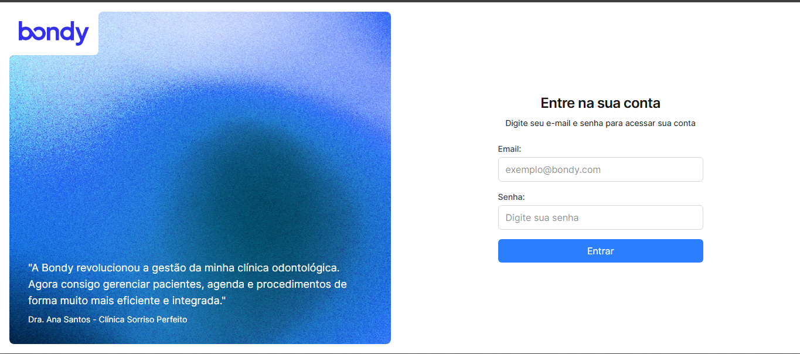

# Bondy Fullstack Challenge

## Preview

*Página de login*

*Backend test coverage para mutations*

### Aviso: adicionei a dependencia cross-env na root do projeto.

Decidi usar typescript com react + tailwind (com a cdn por simplicidade) com o apollo client para o front end.

Criei unit tests no backend pra verificar a logica das mutations criadas (login e mutationTest).

`yarn lerna run test --scope=backend`

mutationTest testa a conexão com o banco e conta os usuários no banco

login faz o processo de login padrão e retorna apenas os valores não sensiveis

Para rodar o projeto:

`yarn install`

`yarn lerna run start --scope=backend`

`yarn lerna run dev --scope=frontend`

Credenciais corretas:
desafio@bondy.com.br 123456

### Contato:

Alexandre dos Santos Pereira

xandykati98@gmail.com

+55 (51) 99840-0251

@xandykati98
